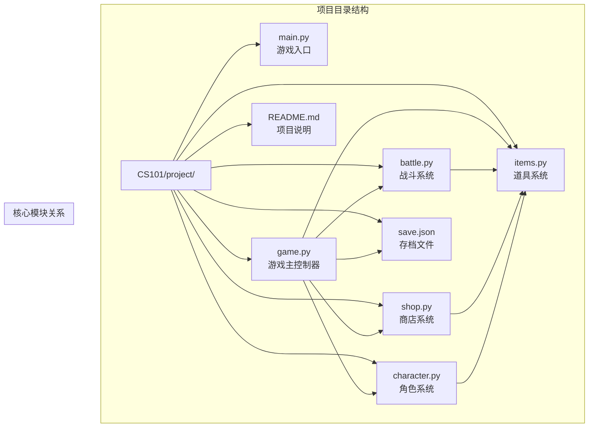
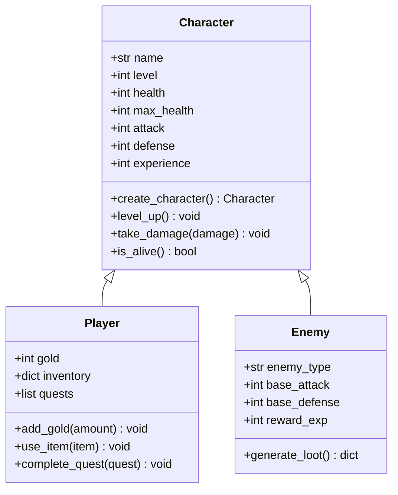
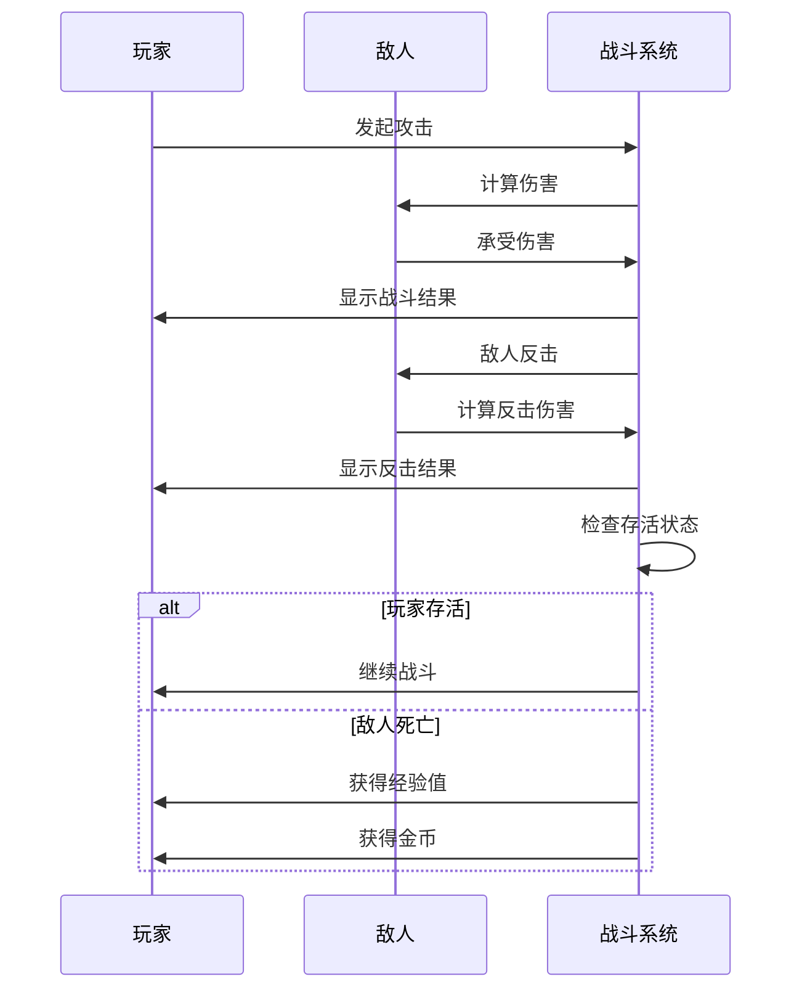

# 假期项目：命令行RPG游戏

<cite>
**本文档引用的文件**
- [CS101/README.md](file://CS101/README.md)
</cite>

## 目录
1. [项目简介](#项目简介)
2. [课程目标与学习成果](#课程目标与学习成果)
3. [项目架构设计](#项目架构设计)
4. [核心技术要求](#核心技术要求)
5. [6周项目时间线](#6周项目时间线)
6. [核心组件详细设计](#核心组件详细设计)
7. [开发流程与最佳实践](#开发流程与最佳实践)
8. [质量标准与评估体系](#质量标准与评估体系)
9. [故障排除指南](#故障排除指南)
10. [结语](#结语)

## 项目简介

《勇者传说》是一个专为高一学生设计的命令行角色扮演游戏项目。该项目旨在综合运用Python编程基础知识，通过实际项目开发培养学生的计算思维和编程能力。

### 项目特色
- **沉浸式体验**：构建完整的RPG游戏世界
- **循序渐进**：6周时间线，逐步深入
- **实践导向**：从理论到实践的完整转化
- **创新性**：鼓励个性化创意和解决方案

**章节来源**
- [CS101/README.md:247-258](file://CS101/README.md#L247-L258)

## 课程目标与学习成果

### 课程目标
完成本课程后，学生将能够：
1. 理解计算思维的基本概念
2. 掌握 Python 编程语言的基础语法
3. 运用变量、条件、循环、函数等基本结构编写程序
4. 使用列表和字典组织数据
5. 理解面向对象编程的基本概念
6. 独立完成一个完整的命令行游戏项目

### 学习成果
- **技术技能**：Python编程、面向对象设计、文件操作
- **思维能力**：问题分解、算法设计、系统架构
- **项目经验**：完整软件开发生命周期实践
- **团队协作**：代码审查、版本管理、文档编写

**章节来源**
- [CS101/README.md:18-27](file://CS101/README.md#L18-L27)

## 项目架构设计

### 核心代码结构

**图表来源**
- [CS101/README.md:287-300](file://CS101/README.md#L287-L300)

### 架构设计理念

#### 分层架构
- **表现层**：用户界面和交互逻辑
- **业务层**：游戏核心逻辑和规则
- **数据层**：存储和管理游戏状态

#### 模块化设计
- 每个功能模块独立开发和测试
- 明确的接口定义和依赖关系
- 支持功能扩展和维护

**章节来源**
- [CS101/README.md:287-300](file://CS101/README.md#L287-L300)

## 技术要求

### 开发环境
- **编程语言**：Python 3.10+
- **开发工具**：VS Code + Python插件
- **版本控制**：Git基础使用

### 核心技术栈
- **基础语法**：变量、条件、循环、函数
- **数据结构**：列表、字典、类和对象
- **文件操作**：JSON格式数据持久化
- **模块化**：import机制和包管理

### 必备技能清单
- Python基础语法掌握
- 面向对象编程理解
- 文件读写操作
- 错误处理机制
- 代码调试技巧

**章节来源**
- [CS101/README.md:318-321](file://CS101/README.md#L318-L321)

## 6周项目时间线

### 第1周：需求分析与设计
**目标**：完成游戏设计文档
- 游戏世界观设定
- 核心玩法机制设计
- 技术架构规划
- 数据模型设计

**里程碑检查**：包含世界观、角色、流程图的设计文档

### 第2周：角色系统开发
**目标**：实现Character类及其子类
- 角色基础属性设计
- 职业系统实现
- 属性计算逻辑
- 角色创建流程

**里程碑检查**：可创建角色并显示属性

### 第3周：战斗系统开发
**目标**：完成完整战斗逻辑
- 回合制战斗机制
- 战斗计算公式
- 战斗结果判定
- 战斗动画效果

**里程碑检查**：回合制战斗完整运行

### 第4周：道具与商店系统
**目标**：实现物品类与商店功能
- 道具分类和属性
- 商店购买系统
- 背包管理功能
- 使用效果实现

**里程碑检查**：商店和背包功能正常

### 第5周：游戏流程与存档
**目标**：完善主循环与数据持久化
- 游戏主循环设计
- 流程控制逻辑
- 存档/读档功能
- 用户界面优化

**里程碑检查**：主循环和存档功能完成

### 第6周：完善与展示
**目标**：最终版本交付
- 代码质量检查
- 文档完善
- 性能优化
- 项目答辩准备

**里程碑检查**：代码整洁、文档完整

**章节来源**
- [CS101/README.md:261-284](file://CS101/README.md#L261-L284)

## 核心组件详细设计

### 角色系统设计

#### 角色基础架构

**图表来源**
- [CS101/README.md:287-300](file://CS101/README.md#L287-L300)

#### 职业系统设计
- **战士**：高生命值，高防御
- **法师**：高魔法攻击，低物理防御
- **盗贼**：高敏捷，暴击率加成

### 战斗系统设计

#### 战斗流程

**图表来源**
- [CS101/README.md:199-201](file://CS101/README.md#L199-L201)

### 道具系统设计

#### 道具分类
- **消耗品**：治疗药水、魔法药水
- **装备**：武器、防具、饰品
- **材料**：用于制作和合成

#### 商店系统
- 商品随机生成
- 价格动态调整
- 交易逻辑实现

### 存档系统设计

#### 数据持久化
- JSON格式存储
- 结构化数据模型
- 错误处理机制

**章节来源**
- [CS101/README.md:287-300](file://CS101/README.md#L287-L300)

## 开发流程与最佳实践

### 项目管理策略

#### 敏捷开发方法
- **迭代开发**：每周一个小迭代
- **持续集成**：每日代码提交
- **快速反馈**：及时代码审查

#### 版本控制最佳实践
- **分支管理**：主分支稳定，功能分支开发
- **提交规范**：清晰的提交信息
- **标签管理**：里程碑标记

### 代码质量保证

#### 代码规范
- **命名规范**：清晰的变量和函数命名
- **注释标准**：完整的函数和模块注释
- **格式统一**：一致的代码风格

#### 测试策略
- **单元测试**：核心功能测试
- **集成测试**：模块间接口测试
- **用户验收测试**：功能完整性验证

### 团队协作模式

#### 代码审查流程
1. **自检**：开发者自我检查
2. **同伴评审**：同学互相检查
3. **导师审核**：指导教师最终确认

#### 沟通机制
- **定期会议**：每周固定时间讨论
- **问题跟踪**：使用Issue记录问题
- **进度汇报**：每日简短进度更新

**章节来源**
- [CS101/README.md:334-340](file://CS101/README.md#L334-L340)

## 质量标准与评估体系

### 评估维度

#### 技术实现（60%）
- **功能完整性**：所有核心功能正常运行
- **代码质量**：结构清晰，注释完整
- **性能表现**：响应速度快，无明显卡顿

#### 项目管理（25%）
- **进度控制**：按计划完成各阶段目标
- **文档质量**：设计文档和技术文档完整
- **团队协作**：良好的沟通和协作

#### 创新价值（15%）
- **创意表达**：独特的游戏设计元素
- **用户体验**：友好的交互设计
- **扩展潜力**：易于后续功能扩展

### 里程碑检查标准

#### 第1周末：设计文档
- 游戏背景故事完整
- 核心玩法机制清晰
- 技术架构合理

#### 第2周末：角色系统
- 角色创建功能完整
- 属性显示准确
- 职业系统可用

#### 第3周末：战斗系统
- 回合制战斗流畅
- 战斗逻辑正确
- 结果判定准确

#### 第4周末：道具系统
- 商店功能正常
- 背包管理有效
- 使用效果实现

#### 第5周末：完整游戏
- 主循环稳定
- 存档功能可靠
- 用户界面友好

#### 第6周末：最终交付
- 代码整洁规范
- 文档完整齐全
- 展示准备充分

**章节来源**
- [CS101/README.md:324-331](file://CS101/README.md#L324-L331)

## 故障排除指南

### 常见问题与解决方案

#### 代码运行问题
- **语法错误**：检查缩进和括号匹配
- **变量未定义**：确认变量声明和作用域
- **模块导入失败**：检查文件路径和模块名

#### 功能实现问题
- **游戏逻辑错误**：使用调试器逐步执行
- **数据不一致**：检查数据结构和更新逻辑
- **界面显示异常**：验证输出格式和编码

#### 性能问题
- **内存泄漏**：检查对象生命周期
- **计算效率低**：优化算法和数据结构
- **I/O性能差**：批量处理和缓存机制

### 调试技巧

#### 代码调试
- **断点调试**：设置关键位置断点
- **日志输出**：添加必要的调试信息
- **单元测试**：隔离测试具体功能

#### 问题定位
- **最小复现**：创建最小可重现示例
- **二分排查**：逐步缩小问题范围
- **版本对比**：比较不同版本的差异

**章节来源**
- [CS101/README.md:334-340](file://CS101/README.md#L334-L340)

## 结语

《勇者传说》项目为学生们提供了一个绝佳的学习机会，通过实际的游戏开发项目，将课堂上学到的理论知识转化为实践技能。这个项目不仅锻炼了编程能力，更重要的是培养了系统性思维和解决问题的能力。

### 项目意义
- **技能提升**：从基础语法到项目实战的完整过渡
- **思维训练**：计算思维和系统设计能力的培养
- **成就感**：完成完整项目的成功体验
- **创新精神**：鼓励个性化创意和解决方案

### 后续发展
完成这个项目后，学生们可以：
- 继续深入学习更高级的编程技术
- 参与更大规模的软件项目
- 培养独立开发能力
- 为计算机科学专业学习打下坚实基础

希望每位同学都能在这个项目中找到乐趣，收获成长，为未来的学习和职业生涯奠定良好基础。

**章节来源**
- [CS101/README.md:343-345](file://CS101/README.md#L343-L345)