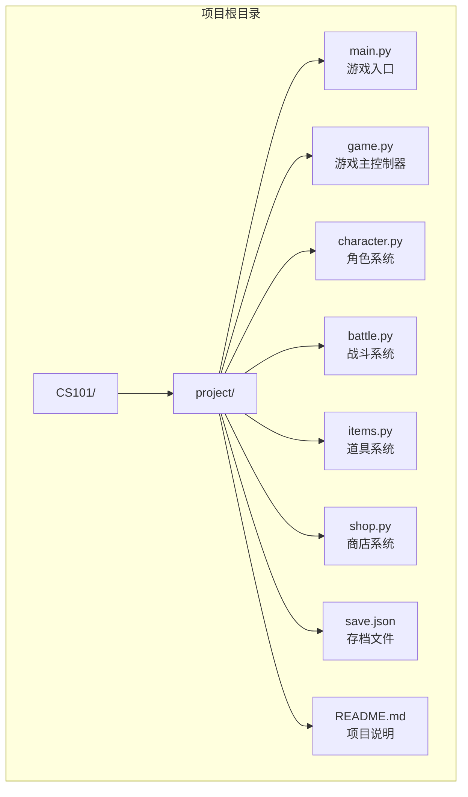
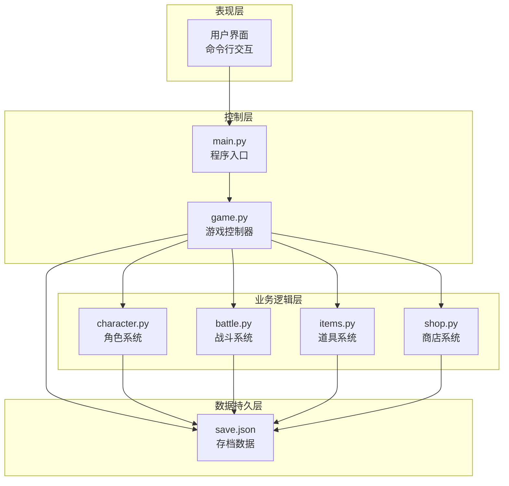
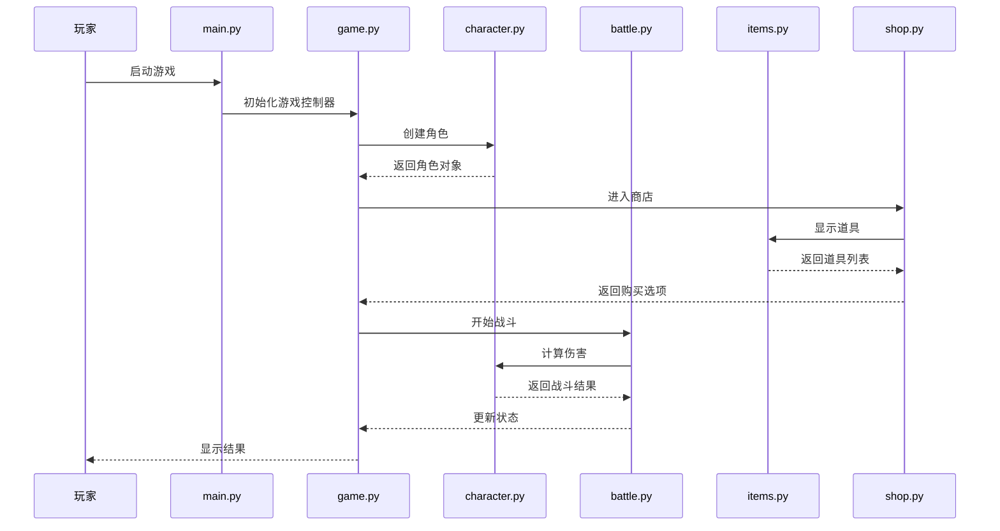
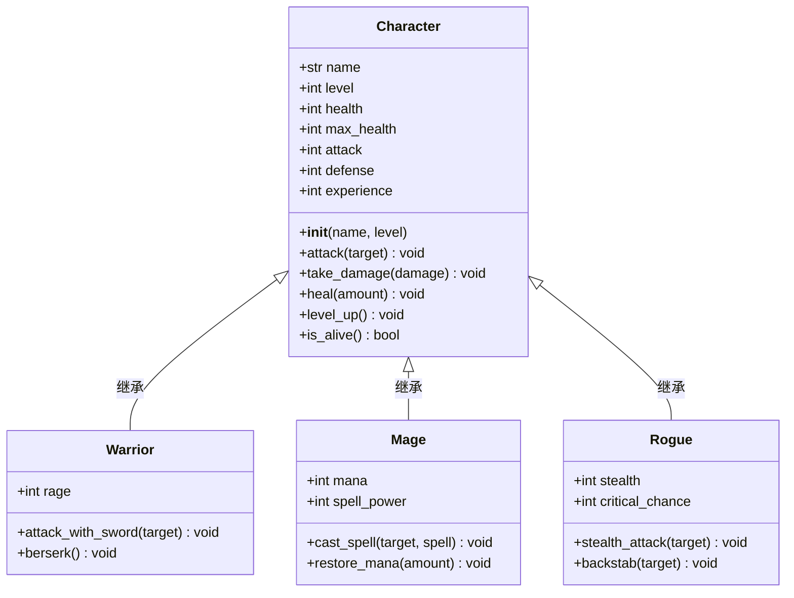
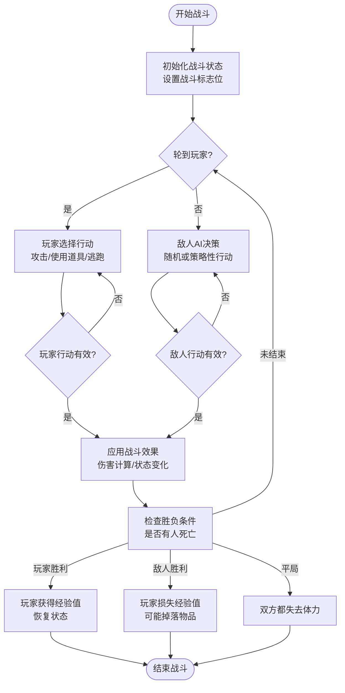
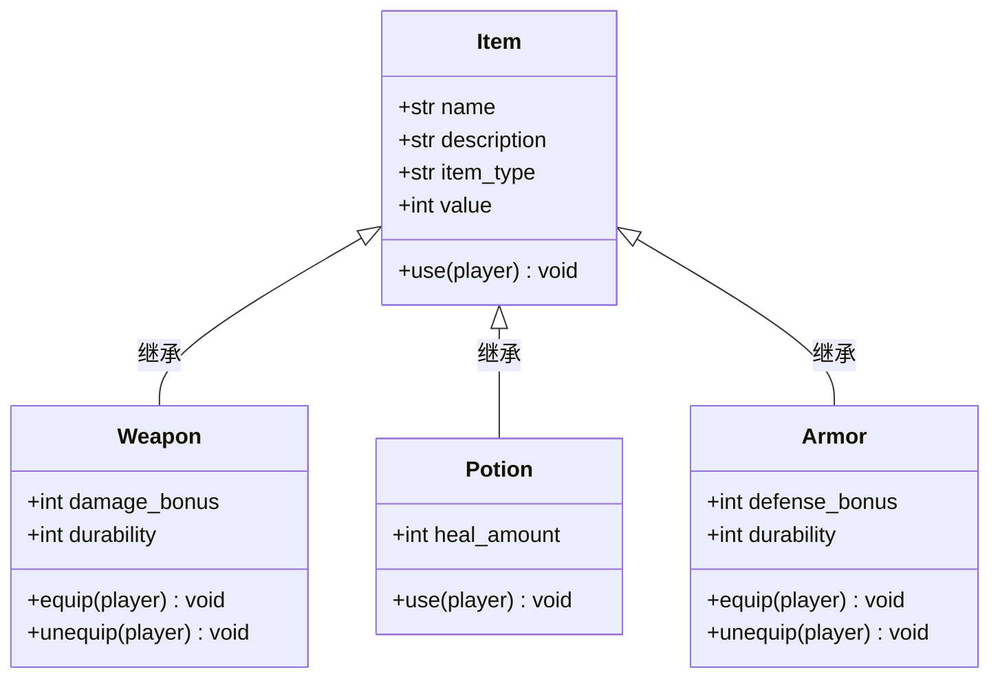
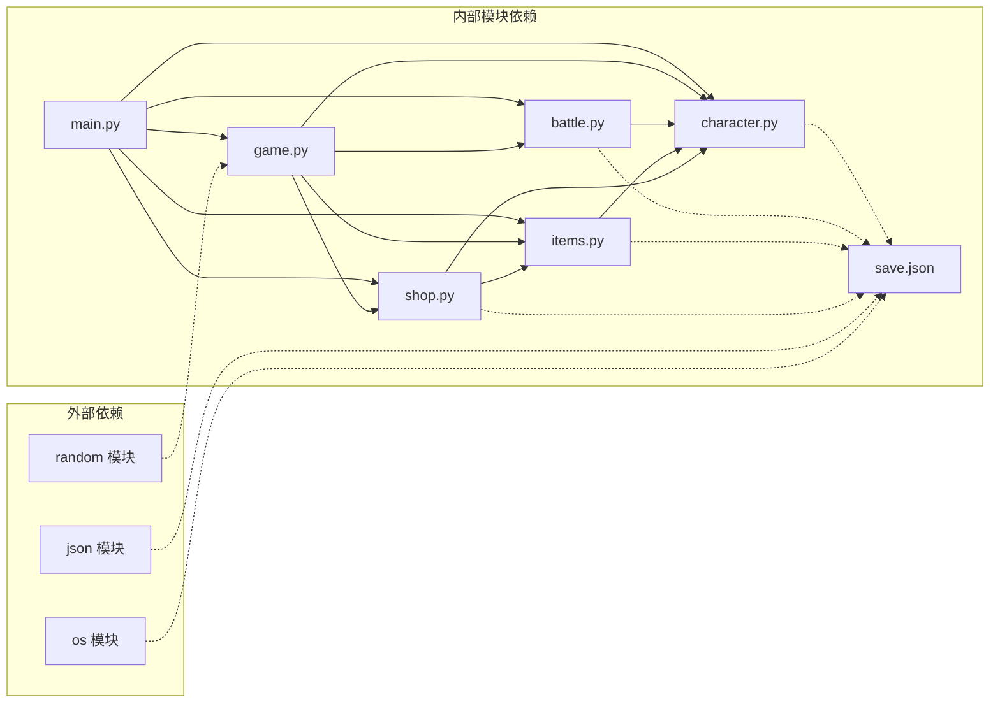

# 核心代码结构

<cite>
**本文档引用的文件**
- [CS101/README.md](file://CS101/README.md)
</cite>

## 目录
1. [引言](#引言)
2. [项目结构](#项目结构)
3. [核心组件](#核心组件)
4. [架构概览](#架构概览)
5. [详细组件分析](#详细组件分析)
6. [依赖分析](#依赖分析)
7. [性能考虑](#性能考虑)
8. [故障排除指南](#故障排除指南)
9. [结论](#结论)

## 引言

《勇者传说》是一个面向高一学生的命令行RPG游戏项目，旨在通过实际的游戏开发项目来教授Python编程的基础知识和计算思维。该项目采用模块化设计，将游戏的不同功能分解为独立的Python模块，每个模块都有明确的职责边界和接口定义。

## 项目结构

根据课程设计文档，项目采用分层的模块化架构，主要包含以下核心文件：

**图表来源**
- [CS101/README.md:287-300](file://CS101/README.md#L287-L300)

### 目录结构设计理念

项目采用了清晰的分层架构设计，体现了以下设计理念：

1. **单一职责原则**：每个模块专注于特定的游戏功能
2. **模块化分离**：功能相关的代码被封装在独立的文件中
3. **清晰的依赖层次**：从入口到具体功能的层次化组织
4. **可维护性优先**：便于单独测试和调试各个功能模块

**章节来源**
- [CS101/README.md:287-300](file://CS101/README.md#L287-L300)

## 核心组件

### main.py - 游戏入口点

作为整个游戏的启动文件，main.py负责：
- 初始化游戏环境
- 启动游戏主循环
- 处理用户输入和程序退出
- 协调各个子系统的初始化

### game.py - 游戏主控制器

游戏的核心协调器，承担以下职责：
- 管理游戏状态和生命周期
- 处理游戏流程控制
- 协调各子系统间的交互
- 实现游戏主循环逻辑

### character.py - 角色系统

角色系统的核心模块，包含：
- 基础角色类的定义
- 角色属性管理（生命值、攻击力等）
- 角色行为方法
- 职业继承体系

### battle.py - 战斗系统

专门处理战斗逻辑的模块：
- 回合制战斗算法
- 攻击判定和伤害计算
- 战斗状态管理
- 战斗结果处理

### items.py - 道具系统

管理游戏中各种道具的模块：
- 道具类型定义
- 道具属性和效果
- 背包管理系统
- 道具使用逻辑

### shop.py - 商店系统

处理商店相关功能：
- 商店商品管理
- 购买和出售逻辑
- 金币交易系统
- 商店库存管理

**章节来源**
- [CS101/README.md:245-284](file://CS101/README.md#L245-L284)

## 架构概览

项目采用经典的分层架构模式，体现了良好的软件工程实践：

**图表来源**
- [CS101/README.md:287-300](file://CS101/README.md#L287-L300)

### 控制流分析

**图表来源**
- [CS101/README.md:287-300](file://CS101/README.md#L287-L300)

## 详细组件分析

### 角色系统 (character.py)

角色系统是整个游戏的核心基础模块，采用面向对象设计：

**图表来源**
- [CS101/README.md:205-215](file://CS101/README.md#L205-L215)

### 战斗系统 (battle.py)

战斗系统实现了回合制战斗机制：

**图表来源**
- [CS101/README.md:193-202](file://CS101/README.md#L193-L202)

### 道具系统 (items.py)

道具系统提供了丰富的游戏体验增强功能：

**图表来源**
- [CS101/README.md:205-215](file://CS101/README.md#L205-L215)

## 依赖分析

项目模块间的依赖关系体现了清晰的分层设计：

**图表来源**
- [CS101/README.md:287-300](file://CS101/README.md#L287-L300)

### 依赖关系特点

1. **单向依赖**：所有依赖都是从具体功能模块指向基础模块
2. **中心辐射式**：game.py作为中央协调器，其他模块都依赖于它
3. **无循环依赖**：设计避免了模块间的循环引用
4. **最小依赖原则**：每个模块只依赖于其直接需要的功能

**章节来源**
- [CS101/README.md:287-300](file://CS101/README.md#L287-L300)

## 性能考虑

### 内存管理

- **对象池化**：对于频繁创建销毁的对象（如临时战斗效果），考虑使用对象池减少内存分配开销
- **延迟加载**：非关键模块可以在首次使用时才加载，减少启动时间
- **数据结构优化**：使用合适的数据结构存储大量相似对象

### 执行效率

- **算法优化**：战斗系统中的排序和查找操作应使用高效的算法
- **缓存策略**：对频繁访问的数据建立缓存机制
- **I/O优化**：存档操作应批量处理，减少文件系统访问次数

### 可扩展性

- **插件架构**：为新功能预留扩展点
- **配置驱动**：将可变参数配置化，便于调整而无需修改代码
- **接口抽象**：定义清晰的接口，便于替换实现

## 故障排除指南

### 常见问题诊断

1. **模块导入错误**
   - 检查相对路径和绝对路径的正确性
   - 确保所有模块都在Python路径中
   - 验证模块名与文件名的一致性

2. **游戏循环异常**
   - 检查游戏状态变量的正确更新
   - 验证条件判断逻辑的完整性
   - 确认循环终止条件的正确性

3. **数据持久化失败**
   - 验证JSON文件格式的正确性
   - 检查文件权限和路径有效性
   - 确认序列化和反序列化的兼容性

### 调试建议

- **单元测试**：为每个模块编写独立的测试用例
- **日志记录**：在关键节点添加详细的日志输出
- **断点调试**：使用IDE的调试功能逐步执行代码
- **边界测试**：特别测试极端情况和边界条件

## 结论

《勇者传说》项目展示了优秀的软件工程实践，通过模块化设计实现了高度的可维护性和可扩展性。项目结构遵循了清晰的分层架构原则，每个模块都有明确的职责边界和接口定义。

这种设计不仅有助于教学目的，也为学生提供了学习现代软件开发最佳实践的机会。通过实际的游戏开发项目，学生可以深入理解：

- 面向对象编程的核心概念
- 模块化设计的重要性和实现方法
- 软件架构的设计原则和权衡
- 代码组织和项目管理的最佳实践

项目的成功实施将为学生后续的编程学习奠定坚实的基础，并培养他们的计算思维和问题解决能力。