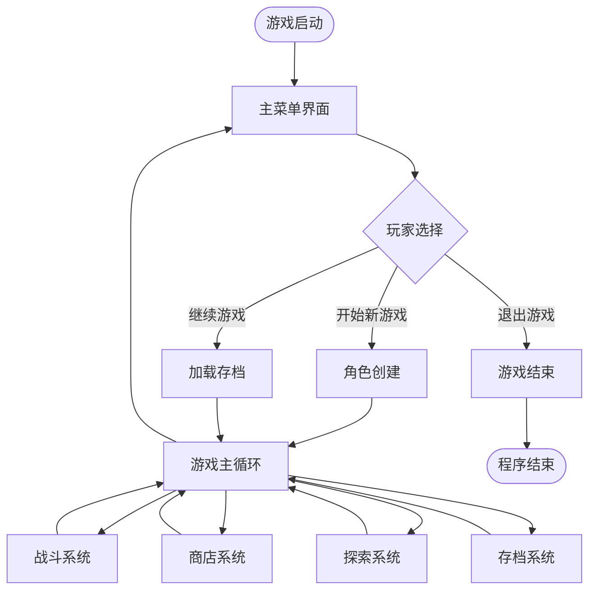
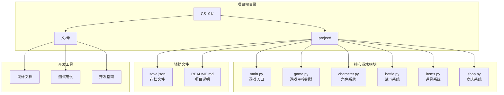

# 项目概述与目标

<cite>
**本文档引用的文件**
- [CS101/README.md](file://CS101/README.md)
</cite>

## 目录
1. [引言](#引言)
2. [项目背景与教育价值](#项目背景与教育价值)
3. [学习目标与能力培养](#学习目标与能力培养)
4. [项目设计理念](#项目设计理念)
5. [核心组件架构](#核心组件架构)
6. [技术实现要求](#技术实现要求)
7. [预期成果与验收标准](#预期成果与验收标准)
8. [项目里程碑规划](#项目里程碑规划)
9. [教学指导原则](#教学指导原则)
10. [结语](#结语)

## 引言

《勇者传说》命令行RPG游戏项目是面向高一学生的综合性编程实践项目。该项目旨在通过游戏开发这一学生感兴趣的主题，将Python编程基础知识与实际应用相结合，培养学生的计算思维和软件开发能力。

本项目基于CS101课程的教学大纲，采用循序渐进的教学方法，从基础语法开始，逐步深入到面向对象编程，最终完成一个完整的RPG游戏项目。通过这个项目，学生不仅能够掌握编程技能，更重要的是学会如何将理论知识应用于实际问题的解决。

## 项目背景与教育价值

### 为什么选择RPG游戏作为综合项目载体

选择RPG游戏作为教学载体具有以下教育优势：

**1. 激发学习兴趣**
- 游戏是学生最感兴趣的应用场景之一
- 通过游戏开发能够保持学生的学习热情
- 提供即时的成就感和满足感

**2. 综合性强**
- 涵盖了编程的所有核心概念
- 需要跨学科的知识整合
- 培养系统性思维能力

**3. 实用价值高**
- 游戏开发是软件行业的热门领域
- 项目经验对学生的未来发展有益
- 培养解决复杂问题的能力

**4. 可扩展性强**
- 可以根据学生水平调整难度
- 支持个性化创作和创新
- 便于后续功能扩展

### 项目的教育目标

通过《勇者传说》项目，学生将实现以下教育目标：

- **编程基础**：掌握Python语言的核心语法和编程范式
- **算法思维**：理解并应用各种算法和数据结构
- **软件工程**：学习软件设计和项目管理的基本方法
- **问题解决**：培养分析问题和解决问题的综合能力
- **团队协作**：在项目实践中培养沟通和协作能力

## 学习目标与能力培养

### 课程学习目标

完成本课程后，学生将能够：

1. **理解计算思维的基本概念** - 掌握抽象化、自动化、分解等思维方式
2. **掌握Python编程语言的基础语法** - 熟练使用变量、条件、循环等基本结构
3. **运用数据结构组织数据** - 灵活使用列表和字典进行数据管理
4. **理解面向对象编程的基本概念** - 掌握类、对象、继承等核心概念
5. **独立完成完整的命令行游戏项目** - 具备独立开发软件的能力

### 技能培养重点

**编程技能**
- 从简单的Hello World到复杂的RPG游戏开发
- 掌握调试技巧和错误处理方法
- 学会代码组织和模块化设计

**思维能力**
- 培养系统性思维和逻辑推理能力
- 提高抽象建模和问题分解能力
- 增强算法设计和优化意识

**工程素养**
- 学习软件开发生命周期管理
- 培养代码规范和文档编写习惯
- 掌握版本控制和测试方法

## 项目设计理念

### 游戏循环设计

游戏循环是RPG游戏的核心机制，它定义了游戏的基本运行模式：

**图表来源**
- [CS101/README.md:220-242](file://CS101/README.md#L220-L242)

### 角色扮演元素

《勇者传说》融合了经典RPG的核心元素：

**角色成长系统**
- 等级提升机制
- 属性点分配
- 技能树设计
- 装备系统

**战斗机制**
- 回合制战斗
- 生命值管理
- 战斗策略
- 战利品掉落

**探索体验**
- 地牢探索
- 随机事件
- NPC交互
- 剧情推进

### 技术架构理念

项目采用分层架构设计，确保代码的可维护性和可扩展性：

**模块化设计**
- 每个功能模块独立开发
- 明确的接口定义
- 良好的封装性

**数据驱动**
- 使用JSON文件存储游戏数据
- 配置与代码分离
- 易于修改和扩展

**错误处理**
- 完善的异常处理机制
- 用户友好的错误提示
- 数据验证和清理

## 核心组件架构

### 项目文件结构

**图表来源**
- [CS101/README.md:287-301](file://CS101/README.md#L287-L301)

### 核心组件职责

**main.py - 游戏入口**
- 程序启动和初始化
- 用户界面调度
- 游戏状态管理

**game.py - 游戏主控制器**
- 游戏逻辑协调
- 状态转换管理
- 数据持久化

**character.py - 角色系统**
- 角色属性管理
- 职业系统实现
- 角色行为控制

**battle.py - 战斗系统**
- 战斗逻辑实现
- 战斗结果计算
- 战斗动画效果

**items.py - 道具系统**
- 道具类型定义
- 道具效果实现
- 背包管理

**shop.py - 商店系统**
- 商店商品管理
- 交易逻辑实现
- 金币系统

## 技术实现要求

### 开发环境要求

**硬件要求**
- 现代计算机或笔记本电脑
- 至少4GB内存
- 足够的磁盘空间

**软件要求**
- Python 3.10或更高版本
- VS Code或其他Python开发环境
- Git版本控制系统

**开发工具**
- Python插件支持
- 代码格式化工具
- 调试工具

### 编程规范

**代码风格**
- 遵循PEP 8编码规范
- 清晰的变量命名
- 适当的注释和文档

**模块化原则**
- 每个文件职责单一
- 函数长度适中
- 类的设计合理

**错误处理**
- 完善的异常处理
- 用户友好的错误信息
- 数据验证机制

### 数据管理

**存档系统**
- JSON格式存储
- 数据结构清晰
- 版本兼容性

**配置管理**
- 配置文件分离
- 默认值设置
- 配置验证

## 预期成果与验收标准

### 可运行的游戏程序

**功能完整性**
- 完整的游戏循环
- 所有核心功能可用
- 用户界面友好
- 性能稳定可靠

**质量标准**
- 代码注释完整
- 错误处理完善
- 边界条件考虑
- 兼容性良好

### 完整的功能模块

**角色系统**
- 角色创建和管理
- 属性显示和修改
- 职业选择和切换
- 升级机制实现

**战斗系统**
- 回合制战斗
- 战斗结果判定
- 战利品系统
- 战斗日志记录

**道具系统**
- 道具分类管理
- 使用效果实现
- 背包容量限制
- 道具合成功能

**商店系统**
- 商品购买和销售
- 价格动态调整
- 金币管理
- 交易记录

### 配套文档

**设计文档**
- 游戏设计理念
- 系统架构说明
- 数据模型设计
- 接口规范定义

**用户手册**
- 游戏玩法说明
- 操作指南
- 故障排除
- 常见问题解答

**开发者文档**
- 代码架构说明
- 开发环境配置
- 测试方法
- 部署指南

## 项目里程碑规划

### 第一周：需求分析与设计

**目标产出**
- 完整的游戏设计文档
- 系统架构设计方案
- 数据模型设计
- 开发计划制定

**关键任务**
- 游戏概念设计
- 功能需求分析
- 技术方案确定
- 风险评估和应对

### 第二周：角色系统开发

**目标产出**
- 角色类及其子类
- 角色属性管理
- 角色创建界面
- 基础角色功能

**验收标准**
- 角色系统可运行
- 属性显示正确
- 角色创建功能完整
- 代码质量达标

### 第三周：战斗系统开发

**目标产出**
- 完整的回合制战斗逻辑
- 战斗结果计算
- 战斗界面实现
- 战斗数据记录

**验收标准**
- 战斗系统完整运行
- 战斗逻辑正确
- 界面友好易用
- 性能满足要求

### 第四周：道具与商店系统

**目标产出**
- 道具类和物品管理
- 商店系统实现
- 背包功能
- 交易系统

**验收标准**
- 道具系统正常
- 商店功能完整
- 背包管理有效
- 交易逻辑正确

### 第五周：游戏流程与存档

**目标产出**
- 主游戏循环
- 存档/读档功能
- 游戏状态管理
- 用户界面优化

**验收标准**
- 游戏可完整运行
- 存档系统稳定
- 界面流畅自然
- 用户体验良好

### 第六周：完善与展示

**目标产出**
- 最终版本游戏
- 完整文档
- 测试报告
- 项目展示材料

**验收标准**
- 代码整洁规范
- 文档完整准确
- 功能全部实现
- 展示效果良好

## 教学指导原则

### 引导式教学

**鼓励自主探索**
- 先让学生尝试解决
- 通过错误学习进步
- 培养独立思考能力

**适度的指导**
- 关键时刻提供帮助
- 解答疑难问题
- 分享最佳实践

**保持学习热情**
- 及时肯定学生努力
- 庆祝小的成功
- 维护学习兴趣

### 实践导向

**项目驱动学习**
- 以项目为核心组织教学
- 在实践中学习理论
- 理论联系实际应用

**渐进式难度**
- 从简单到复杂
- 循序渐进提升
- 符合认知规律

**个性化指导**
- 根据学生水平调整
- 提供不同层次挑战
- 关注个体差异

### 能力培养

**计算思维训练**
- 培养抽象思维
- 发展逻辑推理
- 提高问题分解能力

**工程能力培养**
- 学习软件开发流程
- 培养质量意识
- 建立工程规范

**创新精神激发**
- 鼓励创造性思维
- 支持个性化创作
- 培养探索精神

## 结语

《勇者传说》命令行RPG游戏项目是一个精心设计的综合性教学项目。它不仅能够帮助学生掌握Python编程技能，更重要的是培养他们的计算思维、创新能力和工程素养。

通过这个项目，学生将体验到从零开始构建完整软件系统的全过程，理解软件开发的各个环节和相互关系。这种实践经验对于他们未来的学习和职业发展都具有重要意义。

希望每位参与项目的学生都能在这个过程中获得知识、技能和快乐，为成为优秀的软件工程师奠定坚实的基础。

*"Tell me and I forget. Teach me and I remember. Involve me and I learn."*
— Benjamin Franklin