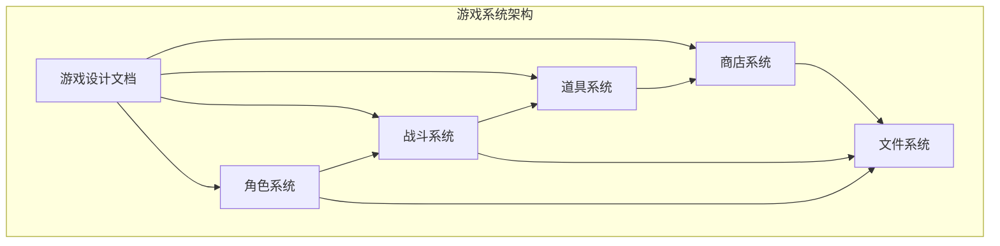
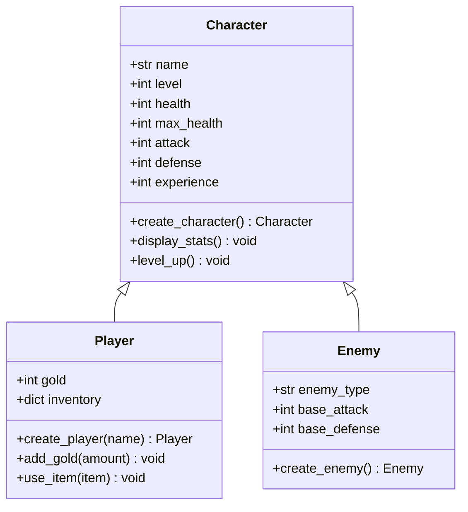
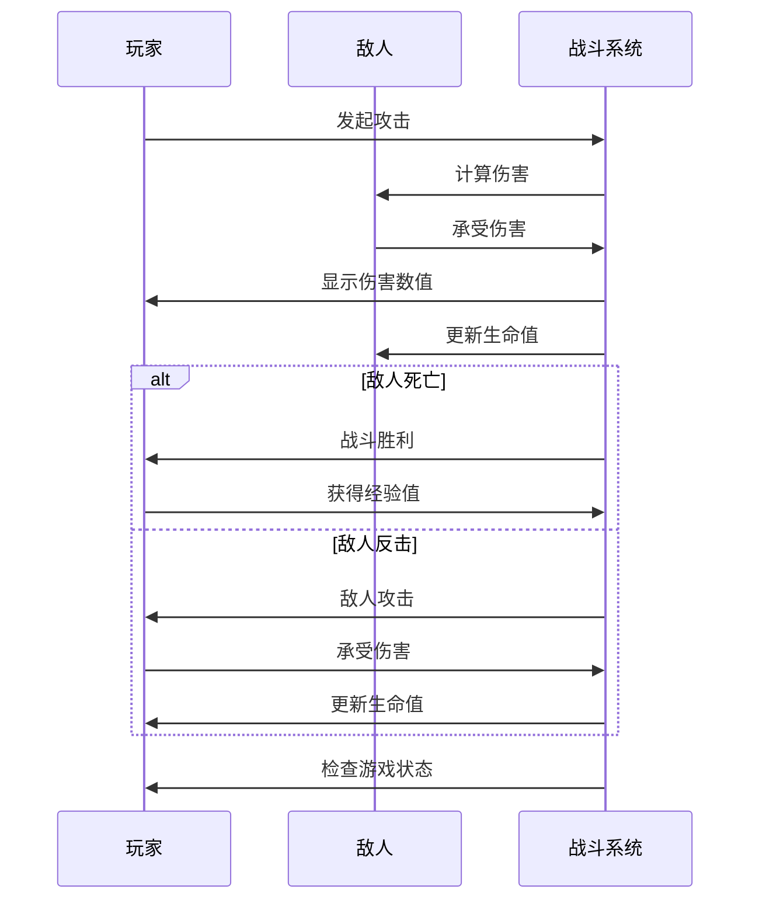
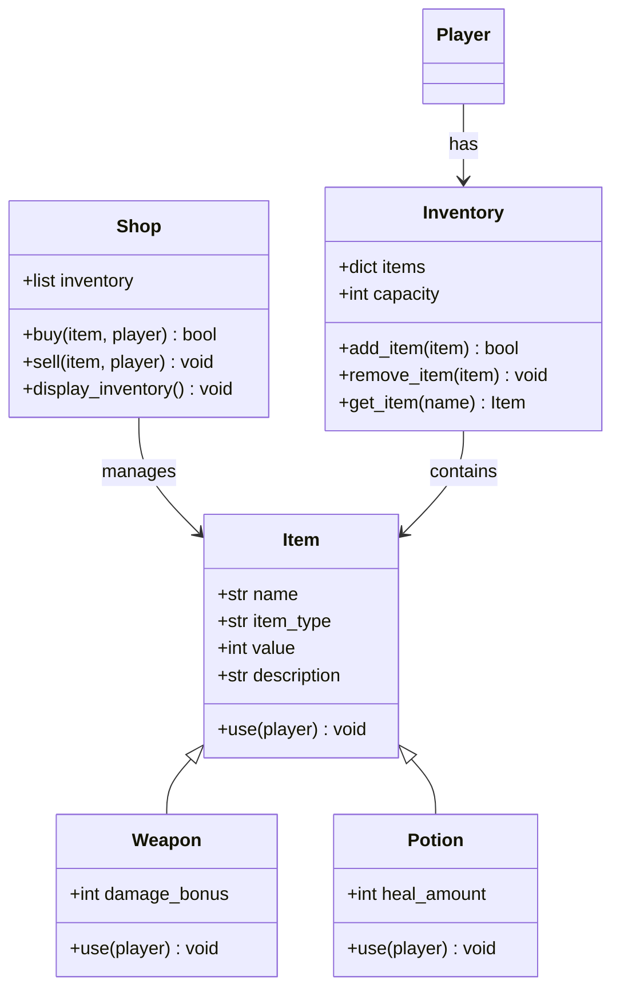
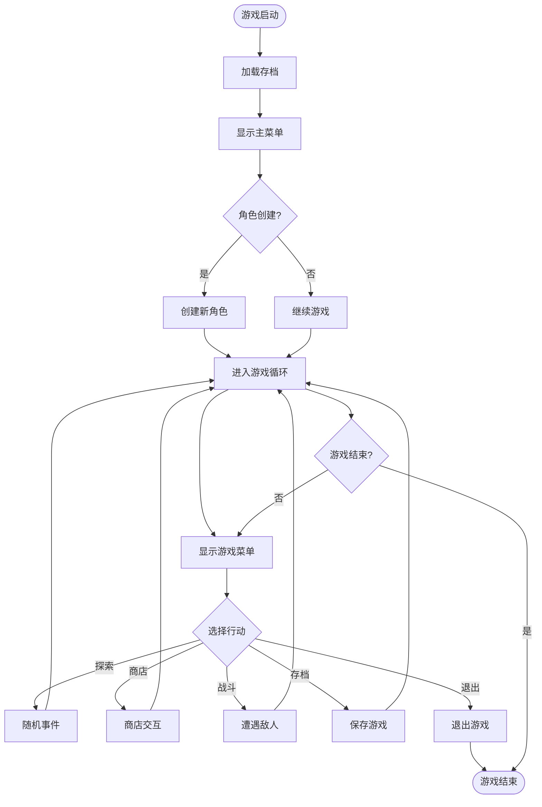
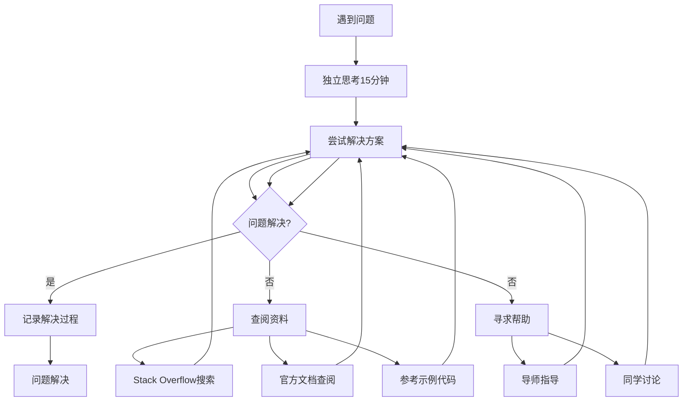

# 项目进度安排

<cite>
**本文引用的文件**
- [CS101/README.md](file://CS101/README.md)
</cite>

## 目录
1. [项目概述](#项目概述)
2. [总体时间安排](#总体时间安排)
3. [第1周：需求分析与设计](#第1周需求分析与设计)
4. [第2周：角色系统开发](#第2周角色系统开发)
5. [第3周：战斗系统开发](#第3周战斗系统开发)
6. [第4周：道具与商店系统](#第4周道具与商店系统)
7. [第5周：游戏流程与存档](#第5周游戏流程与存档)
8. [第6周：完善与展示](#第6周完善与展示)
9. [代码审查与质量保证](#代码审查与质量保证)
10. [问题解决机制](#问题解决机制)
11. [进度跟踪方法](#进度跟踪方法)
12. [学习资源与工具](#学习资源与工具)
13. [结语](#结语)

## 项目概述

《勇者传说》是一个基于Python的命令行角色扮演游戏项目，旨在综合运用CS101课程所学的编程知识，独立完成一个具有完整游戏循环的角色扮演游戏。

### 项目目标
- 开发可运行的Python游戏程序
- 实现角色创建、战斗、升级、道具系统
- 具备存档/读档功能
- 提供完整的设计文档和代码注释

### 技术栈
- 编程语言：Python 3.10+
- 核心模块：面向对象编程、文件操作、随机数生成
- 工具支持：VS Code + Python插件

**章节来源**
- [CS101/README.md:247-258](file://CS101/README.md#L247-L258)
- [CS101/README.md:318-321](file://CS101/README.md#L318-L321)

## 总体时间安排

项目总时长为6周，每周约2-3小时，包含理论学习、实践开发和代码审查三个环节。

### 周度规划

| 周次 | 主题 | 学习时长 | 主要任务 |
|------|------|----------|----------|
| 第1周 | 需求分析与设计 | 2小时 | 游戏设计文档 |
| 第2周 | 角色系统开发 | 1.5小时 | Character类及子类 |
| 第3周 | 战斗系统开发 | 1.5小时 | 完整战斗逻辑 |
| 第4周 | 道具与商店系统 | 1.5小时 | 物品与商店功能 |
| 第5周 | 游戏流程与存档 | 1.5小时 | 主循环与数据持久化 |
| 第6周 | 完善与展示 | 2小时 | 最终版本与答辩 |

**章节来源**
- [CS101/README.md:261-271](file://CS101/README.md#L261-L271)

## 第1周：需求分析与设计

### 学习目标
- 完成游戏设计文档的编写
- 明确游戏的核心玩法和系统架构
- 设计角色、战斗、道具等核心系统的初步方案

### 产出要求
- 完整的游戏设计文档（包含以下要素）
- 游戏世界观设定
- 角色系统设计方案
- 游戏流程图
- 技术实现方案

### 详细学习内容

#### 游戏设计理念
- **核心玩法**：回合制策略战斗
- **游戏主题**：中世纪奇幻背景
- **玩家目标**：成为传奇勇者，拯救王国

#### 系统架构设计

**图表来源**
- [CS101/README.md:287-300](file://CS101/README.md#L287-L300)

### 设计文档模板

#### 1. 世界观设定
- 游戏背景故事
- 主要角色介绍
- 世界地图概览

#### 2. 核心玩法机制
- 角色创建流程
- 战斗系统规则
- 经验值与升级机制
- 道具获取与使用

#### 3. 技术实现方案
- 数据结构设计
- 模块划分
- 文件组织结构

**章节来源**
- [CS101/README.md:274-284](file://CS101/README.md#L274-L284)

## 第2周：角色系统开发

### 学习目标
- 实现Character基类及其子类
- 完成角色属性管理和状态控制
- 建立角色数据的持久化存储

### 技术挑战
- 面向对象设计原则的应用
- 数据封装与接口设计
- 错误处理与边界条件

### 产出要求
- 可运行的角色系统
- 角色属性的完整展示
- 基础的角色操作功能

### 开发重点

#### 角色类设计模式

**图表来源**
- [CS101/README.md:292-295](file://CS101/README.md#L292-L295)

### 关键技术点
- 类的继承与多态
- 属性封装与访问控制
- 数据序列化与反序列化

**章节来源**
- [CS101/README.md:265](file://CS101/README.md#L265)

## 第3周：战斗系统开发

### 学习目标
- 实现完整的回合制战斗逻辑
- 建立伤害计算和生命值管理
- 添加战斗动画效果和反馈

### 技术挑战
- 回合制战斗算法设计
- 随机性与平衡性控制
- 战斗结果的判定逻辑

### 产出要求
- 可进行的完整战斗
- 战斗过程的可视化反馈
- 战斗结果的正确判定

### 战斗系统流程

**图表来源**
- [CS101/README.md:294-296](file://CS101/README.md#L294-L296)

### 核心算法设计
- 伤害计算公式：攻击力 - 防御力 + 随机波动
- 命中率判定：基于角色敏捷属性
- 暴击判定：基于暴击概率配置

**章节来源**
- [CS101/README.md:267](file://CS101/README.md#L267)

## 第4周：道具与商店系统

### 学习目标
- 实现物品类系统和背包管理
- 建立商店购买和销售机制
- 完成道具效果的触发和管理

### 技术挑战
- 物品属性的多样化设计
- 背包容量与物品分类
- 商店库存的动态管理

### 产出要求
- 完整的道具系统
- 商店功能的正常运行
- 背包管理的便捷操作

### 道具系统架构

**图表来源**
- [CS101/README.md:295-297](file://CS101/README.md#L295-L297)

### 商店系统设计
- 物品随机生成机制
- 价格浮动与稀有度
- 库存管理与补货

**章节来源**
- [CS101/README.md:268](file://CS101/README.md#L268)

## 第5周：游戏流程与存档

### 学习目标
- 实现游戏主循环和状态管理
- 建立数据持久化和读档功能
- 完善用户界面和交互体验

### 技术挑战
- 游戏状态的完整保存
- 用户输入的健壮性处理
- 异常情况的优雅降级

### 产出要求
- 可完整运行的游戏
- 存档功能的稳定实现
- 用户友好的交互界面

### 游戏主循环设计

**图表来源**
- [CS101/README.md:291-299](file://CS101/README.md#L291-L299)

### 数据持久化策略
- JSON格式的存档文件
- 分层数据结构设计
- 版本兼容性处理

**章节来源**
- [CS101/README.md:269](file://CS101/README.md#L269)

## 第6周：完善与展示

### 学习目标
- 完成所有功能的最终调试
- 准备项目展示和答辩材料
- 进行代码审查和性能优化

### 产出要求
- 完整可运行的最终版本
- 详细的项目文档
- 演示视频和截图

### 完善检查清单

#### 代码质量检查
- [ ] 代码注释完整且准确
- [ ] 变量命名规范统一
- [ ] 错误处理覆盖全面
- [ ] 性能瓶颈识别与优化

#### 功能完整性检查
- [ ] 所有核心功能正常运行
- [ ] 存档/读档功能稳定
- [ ] 用户界面友好易用
- [ ] 游戏平衡性合理

#### 文档完整性检查
- [ ] 设计文档更新完整
- [ ] 用户手册编写完成
- [ ] 技术文档整理归档
- [ ] 演示材料准备就绪

### 项目展示准备

#### 演示流程设计
1. **项目介绍** (2分钟)
   - 游戏背景和核心特色
   
2. **功能演示** (8分钟)
   - 角色创建和属性展示
   - 战斗系统实机演示
   - 道具系统使用说明
   
3. **技术亮点** (3分钟)
   - 架构设计说明
   - 关键算法解析
   
4. **问答环节** (2分钟)
   - 技术问题解答
   - 改进建议收集

**章节来源**
- [CS101/README.md:270](file://CS101/README.md#L270)

## 代码审查与质量保证

### 审查时间安排

| 周次 | 审查重点 | 审查时长 | 审查形式 |
|------|----------|----------|----------|
| 第2周 | 角色系统架构 | 1.5小时 | 代码审查 |
| 第3周 | 战斗系统逻辑 | 1.5小时 | 代码审查 |
| 第4周 | 道具系统实现 | 1.5小时 | 代码审查 |
| 第5周 | 存档系统测试 | 1.5小时 | 代码审查 |
| 第6周 | 最终版本验收 | 2小时 | 项目答辩 |

### 代码质量标准

#### 基础要求
- 符合PEP8编码规范
- 完整的函数和类注释
- 合理的异常处理机制
- 清晰的变量命名

#### 进阶要求
- 模块化设计良好
- 代码复用性高
- 性能优化到位
- 可扩展性强

**章节来源**
- [CS101/README.md:265-270](file://CS101/README.md#L265-L270)

## 问题解决机制

### 自主解决流程

### 导师指导策略
- **引导而非代劳**：鼓励学生先尝试解决
- **及时反馈**：每周定期检查进度
- **鼓励试错**：允许在安全范围内犯错
- **保持热情**：关注学习兴趣和动力

**章节来源**
- [CS101/README.md:334-340](file://CS101/README.md#L334-L340)

## 进度跟踪方法

### 周度检查标准

#### 第1周末：设计文档完成
- 包含游戏世界观、角色设定、流程图
- 设计思路清晰完整
- 技术方案可行可靠

#### 第2周末：角色系统可运行
- 可创建角色并显示属性
- 基础操作功能正常
- 代码结构清晰合理

#### 第3周末：可进行一场战斗
- 回合制战斗完整运行
- 伤害计算逻辑正确
- 战斗反馈机制完善

#### 第4周末：可购买使用道具
- 商店和背包功能正常
- 道具效果按设计实现
- 用户交互流畅自然

#### 第5周末：游戏可完整运行
- 主循环和存档功能完成
- 游戏平衡性合理
- 性能表现良好

#### 第6周末：项目最终交付
- 代码整洁、文档完整
- 功能完整无缺陷
- 展示效果优秀

### 进度跟踪工具建议
- 使用GitHub Issues跟踪任务
- 建立个人学习日志
- 定期进行自我评估
- 与导师定期沟通反馈

**章节来源**
- [CS101/README.md:274-284](file://CS101/README.md#L274-L284)

## 学习资源与工具

### 推荐学习资源

#### 教材推荐
- 《Python编程：从入门到实践》（第3版）— Eric Matthes
- 《笨办法学Python 3》— Zed Shaw

#### 在线资源
- Harvard CS50's Introduction to Programming with Python
- MIT 6.0001 Introduction to Computer Science and Programming in Python

#### 练习平台
- Codecademy Python
- Python Tutor（代码可视化）

### 开发工具配置

#### 必备工具
- VS Code + Python插件
- Python 3.10+
- Git版本控制系统

#### 开发环境建议
- 使用虚拟环境隔离依赖
- 配置代码格式化工具
- 设置自动测试脚本

**章节来源**
- [CS101/README.md:304-321](file://CS101/README.md#L304-L321)

## 结语

《勇者传说》项目不仅是对CS101课程知识的综合运用，更是培养计算思维和编程能力的重要实践。通过这6周的系统性学习和开发，学生将：

1. **掌握编程技能**：从基础语法到面向对象编程的完整体系
2. **培养工程思维**：学会系统设计和架构规划
3. **提升解决问题的能力**：通过实际项目锻炼调试和优化能力
4. **建立学习方法论**：形成可持续的学习和成长模式

记住，编程学习是一个循序渐进的过程，遇到困难时不要气馁。按照既定的时间表和学习目标，一步一个脚印地前进，相信每位同学都能成功完成这个有意义的项目。

祝大家学习顺利，享受编程的乐趣！