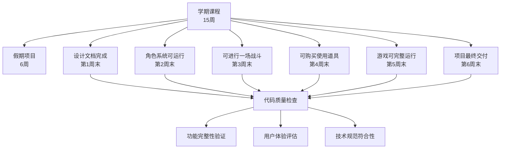
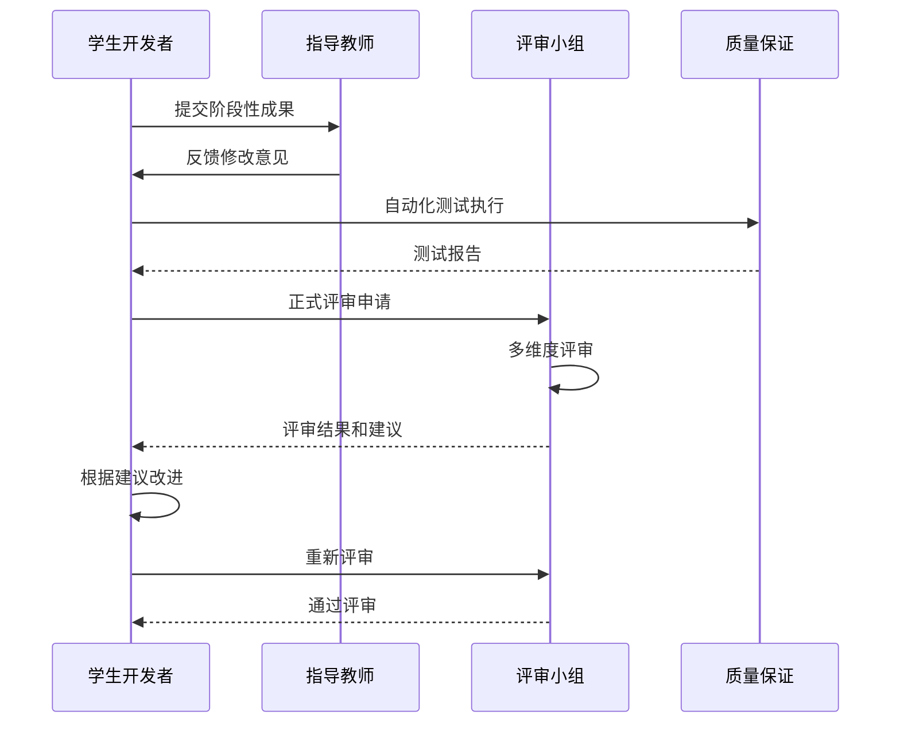
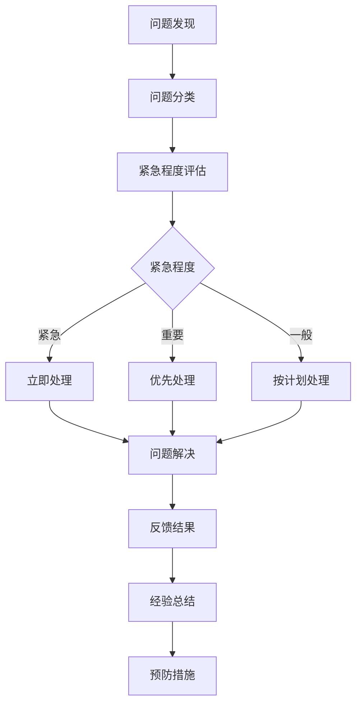

# 项目里程碑检查点

<cite>
**本文档中引用的文件**
- [CS101/README.md](file://CS101/README.md)
- [AGENTS.md](file://AGENTS.md)
</cite>

## 目录
1. [项目概述](#项目概述)
2. [里程碑管理体系](#里程碑管理体系)
3. [设计文档完成里程碑](#设计文档完成里程碑)
4. [角色系统可运行里程碑](#角色系统可运行里程碑)
5. [可进行战斗里程碑](#可进行战斗里程碑)
6. [可购买使用道具里程碑](#可购买使用道具里程碑)
7. [游戏可完整运行里程碑](#游戏可完整运行里程碑)
8. [项目最终交付里程碑](#项目最终交付里程碑)
9. [评审流程与质量标准](#评审流程与质量标准)
10. [问题反馈机制](#问题反馈机制)
11. [进度调整策略](#进度调整策略)
12. [结论](#结论)

## 项目概述

CS101《编程基础与计算思维》是针对高一学生的Python编程课程，为期15周的学期课程加上6周的假期项目，总时长32.5小时。课程采用"螺旋式上升"的教学理念，通过实践项目培养学生的编程兴趣和计算思维能力。

### 课程目标
- 理解计算思维的基本概念
- 掌握Python编程语言的基础语法
- 运用变量、条件、循环、函数等基本结构编写程序
- 使用列表和字典组织数据
- 理解面向对象编程的基本概念
- 独立完成一个完整的命令行游戏项目

### 项目背景
本课程的最终项目是开发一个命令行RPG游戏《勇者传说》，要求包含角色创建、战斗、升级、道具系统和存档功能。项目采用模块化设计，分为5个主要模块：基础语法、函数与模块、面向对象、综合应用和假期项目实践。

## 里程碑管理体系

### 总体时间安排

**图表来源**
- [CS101/README.md: 274-284:274-284](file://CS101/README.md#L274-L284)

### 里程碑检查标准

| 里程碑 | 预期完成时间 | 检查标准 | 质量要求 | 验收标准 |
|--------|-------------|----------|----------|----------|
| 设计文档完成 | 第1周末 | 包含世界观、角色、流程图 | 文档完整、逻辑清晰 | 设计文档通过评审 |
| 角色系统可运行 | 第2周末 | 可创建角色并显示属性 | 代码结构合理、功能完整 | 角色创建测试通过 |
| 可进行一场战斗 | 第3周末 | 回合制战斗完整运行 | 战斗逻辑正确、异常处理完善 | 战斗系统功能测试通过 |
| 可购买使用道具 | 第4周末 | 商店和背包功能正常 | 道具系统完整、数据持久化有效 | 道具系统集成测试通过 |
| 游戏可完整运行 | 第5周末 | 主循环和存档功能完成 | 游戏流程完整、性能稳定 | 完整游戏流程测试通过 |
| 项目最终交付 | 第6周末 | 代码整洁、文档完整 | 代码规范、注释完整 | 项目验收通过 |

**章节来源**
- [CS101/README.md: 274-284:274-284](file://CS101/README.md#L274-L284)

## 设计文档完成里程碑

### 预期完成时间
第1周末（2024年1月）

### 检查标准

#### 文档完整性
- **世界观设定**：游戏背景故事、设定规则、魔法系统
- **角色系统设计**：职业分类、属性体系、成长机制
- **战斗系统设计**：回合制机制、伤害计算、技能系统
- **道具系统设计**：物品分类、效果机制、获取途径
- **游戏流程图**：主菜单、游戏循环、存档流程

#### 技术规范
- 使用标准文档格式（Markdown）
- 包含必要的图表和示意图
- 语言表达清晰、逻辑连贯
- 符合项目开发要求

### 质量要求

#### 内容质量
- **完整性**：涵盖所有核心功能模块
- **准确性**：技术方案可行、逻辑一致
- **可执行性**：设计方案可实现、边界清晰
- **前瞻性**：考虑未来扩展需求

#### 文档质量
- **结构清晰**：层次分明、条理清楚
- **表达准确**：术语统一、描述精确
- **格式规范**：排版整齐、引用规范
- **可维护性**：便于后续修改和更新

### 验收标准

#### 评审要点
- 设计方案是否满足项目目标
- 技术实现是否可行
- 功能覆盖是否完整
- 风险评估是否充分

#### 通过标准
- 评审专家一致同意
- 无重大设计缺陷
- 技术方案获得认可
- 开发计划得到批准

**章节来源**
- [CS101/README.md: 261-271:261-271](file://CS101/README.md#L261-L271)

## 角色系统可运行里程碑

### 预期完成时间
第2周末（2024年1月）

### 检查标准

#### 核心功能
- **角色创建**：支持用户输入基本信息
- **属性显示**：正确显示角色各项属性
- **基础交互**：角色状态管理功能
- **数据验证**：输入参数的有效性检查

#### 代码质量
- **模块化设计**：Character类结构清晰
- **错误处理**：异常情况的妥善处理
- **代码注释**：关键逻辑的详细说明
- **命名规范**：变量和函数命名规范

### 质量要求

#### 功能完整性
- **创建流程**：从输入到显示的完整流程
- **属性管理**：生命值、攻击力、防御力等
- **状态检查**：角色状态的正确性验证
- **边界处理**：异常输入的处理机制

#### 代码规范
- **单一职责**：每个函数职责明确
- **可重用性**：代码模块化程度高
- **可测试性**：便于单元测试和集成测试
- **可维护性**：代码结构易于理解和修改

### 验收标准

#### 测试覆盖
- **单元测试**：核心功能的单元测试通过
- **集成测试**：模块间接口测试通过
- **用户测试**：基本使用场景验证通过
- **性能测试**：响应时间符合要求

#### 评审标准
- 代码通过代码审查
- 功能满足设计要求
- 用户界面友好易用
- 文档同步更新

**章节来源**
- [CS101/README.md: 266](file://CS101/README.md#L266)

## 可进行战斗里程碑

### 预期完成时间
第3周末（2024年1月）

### 检查标准

#### 战斗系统功能
- **回合制机制**：玩家与敌人的轮流行动
- **伤害计算**：基于攻击力和防御力的伤害公式
- **生命值管理**：血量变化和死亡判定
- **战斗流程**：开始、进行、结束的完整流程

#### 异常处理
- **输入验证**：玩家选择的有效性检查
- **状态检查**：战斗状态的正确性验证
- **边界条件**：极端情况的处理
- **错误恢复**：异常情况的恢复机制

### 质量要求

#### 算法正确性
- **数学公式**：伤害计算公式的正确性
- **逻辑流程**：战斗回合的逻辑正确性
- **状态转移**：角色状态的正确转换
- **边界处理**：各种边界条件的处理

#### 用户体验
- **交互流畅**：战斗过程的自然流畅
- **反馈及时**：操作结果的及时反馈
- **信息清晰**：战斗状态的清晰显示
- **操作简便**：战斗指令的简单易懂

### 验收标准

#### 功能测试
- **基础战斗**：单次战斗的完整测试
- **连续战斗**：多轮战斗的稳定性测试
- **特殊效果**：技能和道具的使用测试
- **失败场景**：战斗失败的各种情况测试

#### 性能要求
- **响应速度**：战斗操作的快速响应
- **内存使用**：战斗过程中的内存占用
- **CPU效率**：战斗算法的执行效率
- **资源管理**：战斗资源的正确释放

**章节来源**
- [CS101/README.md: 267](file://CS101/README.md#L267)

## 可购买使用道具里程碑

### 预期完成时间
第4周末（2024年1月）

### 检查标准

#### 商店系统
- **商品展示**：商店物品的正确显示
- **购买流程**：购买物品的完整流程
- **金币管理**：玩家金币的正确计算
- **库存管理**：商店物品数量的控制

#### 道具系统
- **物品分类**：武器、防具、消耗品的分类
- **效果实现**：道具使用后的属性变化
- **背包管理**：玩家物品的存储和管理
- **使用机制**：道具使用的触发和效果

### 质量要求

#### 数据一致性
- **状态同步**：玩家状态与数据库的一致性
- **事务处理**：购买操作的原子性保证
- **并发控制**：多用户操作的冲突避免
- **数据完整性**：关键数据的完整性保护

#### 系统稳定性
- **异常处理**：购买失败的各种异常处理
- **回滚机制**：操作失败时的状态恢复
- **日志记录**：重要操作的日志记录
- **监控告警**：异常情况的及时告警

### 验收标准

#### 功能完整性
- **商店功能**：购买、出售、浏览功能完整
- **道具功能**：装备、使用、丢弃功能完整
- **数据持久化**：物品状态的正确保存
- **网络同步**：多设备间的同步一致性

#### 用户体验
- **界面友好**：商店和背包界面的易用性
- **操作便捷**：购买和使用道具的便利性
- **信息透明**：物品属性和效果的清晰显示
- **反馈及时**：操作结果的即时反馈

**章节来源**
- [CS101/README.md: 268](file://CS101/README.md#L268)

## 游戏可完整运行里程碑

### 预期完成时间
第5周末（2024年1月）

### 检查标准

#### 主游戏循环
- **状态管理**：游戏各状态间的正确转换
- **事件处理**：用户输入和系统事件的处理
- **渲染更新**：游戏画面的正确刷新
- **时间控制**：游戏节奏的合理控制

#### 存档系统
- **数据序列化**：游戏状态的正确保存
- **文件管理**：存档文件的创建和管理
- **加载机制**：存档数据的正确读取
- **兼容性**：不同版本间的存档兼容

### 质量要求

#### 架构设计
- **模块分离**：各功能模块的清晰分离
- **接口设计**：模块间接口的稳定性
- **扩展性**：新功能的易于添加
- **解耦设计**：模块间的低耦合度

#### 性能优化
- **内存管理**：游戏运行时的内存优化
- **CPU使用**：游戏逻辑的高效执行
- **I/O优化**：文件读写的性能优化
- **渲染优化**：画面更新的性能优化

### 验收标准

#### 系统集成
- **模块集成**：各功能模块的正确集成
- **接口测试**：模块间通信的稳定性测试
- **性能测试**：整体性能指标的达标
- **兼容性测试**：不同环境下的兼容性验证

#### 用户验收
- **完整流程**：从开始到结束的完整游戏体验
- **错误处理**：各种异常情况的正确处理
- **性能表现**：游戏运行的流畅性和稳定性
- **用户体验**：整体游戏体验的满意度

**章节来源**
- [CS101/README.md: 269](file://CS101/README.md#L269)

## 项目最终交付里程碑

### 预期完成时间
第6周末（2024年1月）

### 检查标准

#### 代码质量
- **代码规范**：遵循Python编码规范
- **注释完整**：关键代码的详细注释
- **命名规范**：变量和函数的规范命名
- **模块化程度**：代码结构的模块化设计

#### 文档完整性
- **设计文档**：项目设计的完整文档
- **用户手册**：游戏使用指南
- **开发文档**：技术实现细节
- **API文档**：接口使用说明

### 质量要求

#### 代码规范
- **PEP8标准**：遵循Python官方编码规范
- **代码风格**：统一的代码风格和格式
- **错误处理**：完善的异常处理机制
- **安全考虑**：输入验证和安全防护

#### 项目管理
- **版本控制**：Git版本管理的规范使用
- **分支管理**：合理的分支开发策略
- **提交规范**：有意义的提交信息
- **发布流程**：规范的版本发布流程

### 验收标准

#### 最终评审
- **功能完整**：所有预定功能的实现
- **质量达标**：代码质量和性能要求
- **文档齐全**：完整的项目文档
- **演示准备**：项目演示的充分准备

#### 交付标准
- **源代码**：完整的可编译源代码
- **可执行文件**：可直接运行的程序
- **安装包**：完整的安装和部署包
- **许可证**：适当的开源许可证

**章节来源**
- [CS101/README.md: 270](file://CS101/README.md#L270)

## 评审流程与质量标准

### 评审流程

**图表来源**
- [CS101/README.md: 334-340:334-340](file://CS101/README.md#L334-L340)

### 质量评估维度

#### 技术质量
- **代码质量**：代码结构、可读性、可维护性
- **功能质量**：功能完整性、正确性、稳定性
- **性能质量**：执行效率、资源使用、响应时间
- **安全性**：输入验证、异常处理、安全防护

#### 业务质量
- **需求符合度**：功能实现与需求的一致性
- **用户体验**：界面友好性、操作便利性、反馈及时性
- **文档质量**：文档完整性、准确性、可维护性
- **可扩展性**：系统架构的扩展能力和灵活性

### 评审标准

#### 量化指标
- **代码覆盖率**：单元测试覆盖率达到80%以上
- **缺陷密度**：每千行代码缺陷数不超过5个
- **构建成功率**：自动化构建成功率达到100%
- **性能基准**：关键操作响应时间不超过指定阈值

#### 质性指标
- **架构合理性**：系统设计的合理性和前瞻性
- **实现质量**：代码实现的技术水平和规范性
- **文档质量**：文档的完整性、准确性和实用性
- **团队协作**：开发过程中的协作效率和沟通质量

**章节来源**
- [CS101/README.md: 324-331:324-331](file://CS101/README.md#L324-L331)

## 问题反馈机制

### 反馈渠道

#### 日常反馈
- **代码审查**：定期的代码审查会议
- **一对一指导**：个性化的学习指导和反馈
- **小组讨论**：同学间的互相学习和讨论
- **在线问答**：随时的问题解答和技术支持

#### 结果反馈
- **阶段性测试**：定期的功能测试和性能评估
- **同行评议**：同龄开发者的技术评议
- **用户反馈**：目标用户的使用体验反馈
- **导师评价**：指导教师的专业评价和建议

### 反馈处理流程

### 改进措施

#### 短期改进
- **立即修复**：发现即刻修复的严重问题
- **快速迭代**：小步快跑的持续改进
- **临时方案**：过渡性的解决方案
- **应急响应**：突发问题的快速响应

#### 长期改进
- **架构优化**：系统架构的长期优化
- **流程改进**：开发流程的持续改进
- **工具升级**：开发工具和环境的升级
- **知识积累**：经验和最佳实践的总结

## 进度调整策略

### 风险识别与评估

#### 技术风险
- **实现难度**：某些功能的技术复杂度评估
- **依赖风险**：第三方库和外部服务的可靠性
- **兼容性风险**：不同平台和环境的兼容性问题
- **性能风险**：系统性能可能达到的瓶颈

#### 进度风险
- **时间偏差**：实际进度与计划的偏差分析
- **资源约束**：人力、物力、财力的约束情况
- **外部干扰**：不可控因素对进度的影响
- **质量风险**：为赶进度而牺牲质量的风险

### 调整策略

#### 预防性调整
- **缓冲时间**：为意外情况预留的时间缓冲
- **里程碑分解**：将大里程碑分解为更小的目标
- **技术储备**：关键技术的提前研究和准备
- **资源备份**：关键资源的备用方案

#### 应急性调整
- **范围调整**：根据实际情况调整功能范围
- **时间调整**：重新安排时间表和优先级
- **资源调整**：重新分配人力和其他资源
- **技术调整**：采用替代技术和方案

### 监控与预警

#### 关键指标监控
- **进度跟踪**：实际进度与计划进度的对比
- **质量监控**：代码质量和测试结果的跟踪
- **风险监控**：潜在风险的识别和评估
- **资源监控**：资源使用情况和可用性

#### 预警机制
- **阈值设置**：关键指标的预警阈值
- **预警触发**：达到阈值时的自动预警
- **响应机制**：预警后的应对措施
- **持续监控**：预警后的持续跟踪

## 结论

CS101项目的里程碑管理体系为整个开发过程提供了清晰的路线图和质量标准。通过分阶段的里程碑设置，确保了项目在技术难度、时间安排和质量要求方面的平衡。

### 体系特点

#### 分层递进
- **渐进式难度**：从简单功能到复杂系统的逐步提升
- **技能递进**：从基础语法到高级概念的系统学习
- **项目递进**：从简单程序到完整游戏的综合实践
- **思维递进**：从具体实现到抽象设计的思维提升

#### 质量保障
- **多维度评估**：技术质量、业务质量、用户体验的全面评估
- **持续改进**：通过反馈机制实现持续的质量改进
- **风险控制**：通过风险管理确保项目按计划推进
- **标准统一**：通过统一标准保证质量的一致性

#### 实践导向
- **项目驱动**：通过实际项目培养实践能力
- **问题解决**：通过解决实际问题提升技术水平
- **创新鼓励**：鼓励创新思维和个性化表达
- **兴趣培养**：通过有趣的项目培养学习兴趣

### 实施建议

#### 对开发者的建议
- **循序渐进**：严格按照里程碑计划推进开发
- **注重质量**：在每个阶段都要确保质量达标
- **及时反馈**：遇到问题要及时寻求帮助和反馈
- **持续学习**：利用项目机会深化理论知识

#### 对指导者的建议
- **因材施教**：根据学生能力调整教学方法
- **鼓励创新**：允许学生在框架内发挥创造力
- **及时指导**：在关键节点提供必要的技术指导
- **正面激励**：通过积极反馈保持学习热情

这个里程碑管理体系不仅适用于CS101项目，也为其他类似的教育项目提供了可借鉴的模板。通过明确的目标、严格的检查标准和完善的评审机制，确保学生能够在有限的时间内获得最大的学习收益。