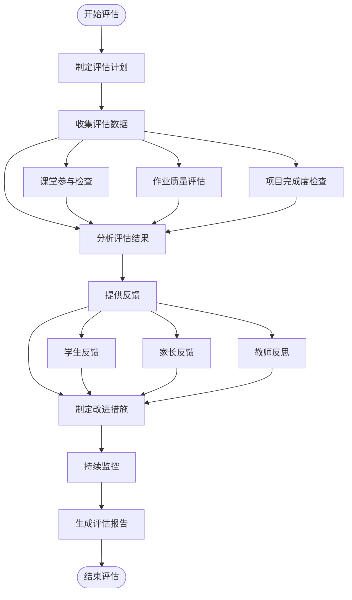
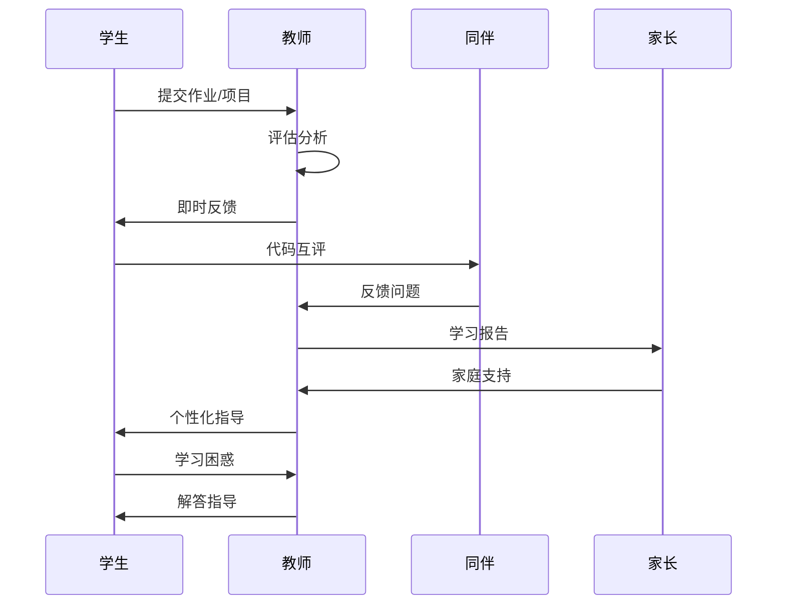
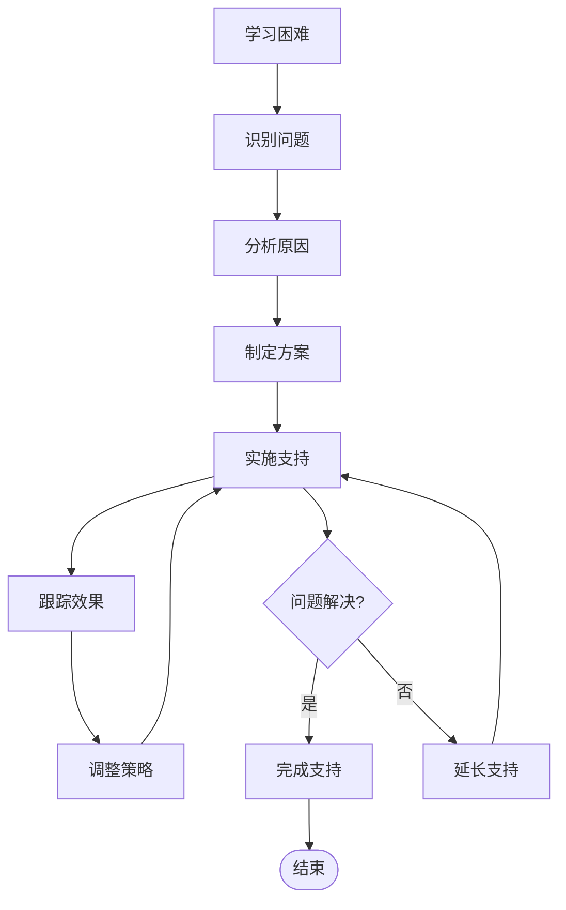

# 评估与反馈体系

<cite>
**本文档引用的文件**
- [CS101/README.md](file://CS101/README.md)
- [AGENTS.md](file://AGENTS.md)
</cite>

## 目录
1. [引言](#引言)
2. [课程概述](#课程概述)
3. [评估体系设计](#评估体系设计)
4. [评估标准与评分细则](#评估标准与评分细则)
5. [反馈机制设计](#反馈机制设计)
6. [教学指导原则](#教学指导原则)
7. [评估工具与模板](#评估工具与模板)
8. [家长沟通与学习支持](#家长沟通与学习支持)
9. [实施流程图](#实施流程图)
10. [结语](#结语)

## 引言

CS101《编程基础与计算思维》是一门面向高一学生的编程入门课程，旨在通过系统的理论学习和实践项目，培养学生的计算思维能力和编程基础技能。本评估与反馈体系基于课程目标和教学特点，建立了科学合理的评价机制，确保评估过程的公平性、透明性和有效性。

## 课程概述

CS101课程总时长为32.5小时，分为两个主要阶段：

### 课程结构
- **学期课程**：15周 × 1.5小时 = 22.5小时
- **假期项目**：6周指导 = 10小时
- **总时长**：32.5小时

### 课程目标
完成本课程后，学生将能够：
1. 理解计算思维的基本概念
2. 掌握 Python 编程语言的基础语法
3. 运用变量、条件、循环、函数等基本结构编写程序
4. 使用列表和字典组织数据
5. 理解面向对象编程的基本概念
6. 独立完成一个完整的命令行游戏项目

### 项目特色
- **项目导向**：每个模块都配有相应的实践项目
- **螺旋式上升**：先实践后理论，遇到问题时再深入原理
- **兴趣驱动**：保护学习热情比完成任务更重要

**章节来源**
- [CS101/README.md:6-38](file://CS101/README.md#L6-L38)
- [CS101/README.md:18-28](file://CS101/README.md#L18-L28)

## 评估体系设计

### 成绩构成比例

根据课程大纲，CS101的评估体系采用以下比例分配：

| 评估项目 | 占比 | 评估重点 |
|---------|------|----------|
| 课堂参与 | 20% | 出勤率、课堂互动、学习态度 |
| 课后作业 | 30% | 作业完成质量、代码规范性 |
| 期末项目 | 50% | 综合应用能力、创新性、完整性 |

### 评估维度设计

#### 课堂参与评估维度
- **出勤表现**：按时上课，积极参与课堂活动
- **互动质量**：主动提问、回答问题、参与讨论
- **学习态度**：专注程度、笔记记录、学习积极性

#### 课后作业评估维度
- **完成度**：按时提交，内容完整
- **正确性**：代码运行结果准确
- **规范性**：代码格式、注释、命名规范
- **创新性**：在基础要求上的拓展和改进

#### 期末项目评估维度
- **功能完整性**：核心功能全部实现
- **代码质量**：结构清晰、可维护性强
- **用户体验**：界面友好、操作流畅
- **文档质量**：设计文档、代码注释完整

**章节来源**
- [CS101/README.md:324-331](file://CS101/README.md#L324-L331)

## 评估标准与评分细则

### 课堂参与评分标准

#### 出勤与参与度（10分制）
- **优秀（9-10分）**：全勤，积极发言，主动帮助同学
- **良好（7-8分）**：缺勤不超过1次，积极参与课堂讨论
- **合格（5-6分）**：基本出勤，偶尔发言
- **需改进（3-4分）**：经常缺勤，很少参与讨论
- **不合格（0-2分）**：频繁缺勤，不参与课堂活动

#### 学习态度评估（10分制）
- **优秀（9-10分）**：学习笔记详细，课后主动复习
- **良好（7-8分）**：有学习笔记，按时完成任务
- **合格（5-6分）**：基本完成学习任务
- **需改进（3-4分）**：需要督促才能完成任务
- **不合格（0-2分）**：经常不完成学习任务

### 课后作业评分标准

#### 基础质量评估（30分制）
- **按时提交（5分）**：在规定时间内提交
- **格式规范（5分）**：代码格式整齐，有适当注释
- **命名规范（5分）**：变量、函数命名符合规范
- **逻辑正确（10分）**：程序运行结果准确
- **测试充分（5分）**：进行了多场景测试

#### 创新性评估（20分制）
- **功能拓展（10分）**：在基础要求上增加额外功能
- **代码优化（5分）**：代码结构更优，效率更高
- **用户体验（5分）**：界面更友好，操作更便捷

### 期末项目评分标准

#### 核心功能评估（40分制）
- **游戏设计（10分）**：游戏玩法清晰，规则合理
- **角色系统（10分）**：角色创建、属性管理完整
- **战斗系统（10分）**：回合制战斗逻辑正确
- **道具系统（10分）**：物品获取、使用功能完整

#### 技术实现评估（30分制）
- **代码结构（10分）**：模块化设计，职责分离
- **异常处理（5分）**：边界情况处理得当
- **数据持久化（5分）**：存档功能正常
- **用户交互（10分）**：界面友好，操作流畅

#### 文档质量评估（20分制）
- **设计文档（10分）**：需求分析、架构设计完整
- **代码注释（5分）**：关键逻辑有适当注释
- **使用说明（5分）**：操作指南清晰易懂

**章节来源**
- [CS101/README.md:324-331](file://CS101/README.md#L324-L331)

## 反馈机制设计

### 及时反馈原则

#### 周期性检查制度
- **每周作业检查**：每周末对本周作业进行检查和反馈
- **阶段性项目评审**：每两周进行一次项目进度检查
- **月度学习评估**：每月进行一次综合学习效果评估

#### 多层次反馈体系
- **即时反馈**：课堂上立即指出问题和优点
- **个别反馈**：针对个人学习情况进行一对一指导
- **小组反馈**：通过同伴互评促进学习交流
- **全班反馈**：总结共性问题，统一指导

### 代码审查机制

#### 自我审查
- **代码自检**：完成作业后进行自我检查
- **注释完善**：为代码添加必要的注释说明
- **格式整理**：确保代码格式规范统一

#### 同伴互评
- **代码交换**：定期进行代码交换和互相检查
- **问题发现**：通过他人视角发现潜在问题
- **经验分享**：交流编程技巧和最佳实践

#### 教师审查
- **重点检查**：对关键代码进行深度审查
- **思路指导**：关注编程思路和方法论
- **规范纠正**：及时纠正代码规范问题

### 学习进度跟踪

#### 个人学习档案
- **学习轨迹记录**：记录每次作业和项目的完成情况
- **能力发展追踪**：跟踪各项技能的发展水平
- **进步趋势分析**：分析学习进步的规律和特点

#### 进度预警机制
- **学习困难识别**：及时发现学习中的困难和障碍
- **个性化支持**：为不同水平的学生提供针对性帮助
- **调整教学策略**：根据学习情况调整教学方法

**章节来源**
- [CS101/README.md:334-340](file://CS101/README.md#L334-L340)

## 教学指导原则

### 核心教学理念

#### 引导而非代劳
- **启发式教学**：通过问题引导学生自主思考
- **渐进式指导**：从简单问题开始，逐步增加难度
- **鼓励探索**：允许学生通过自己的方式解决问题

#### 鼓励试错
- **错误价值观**：将错误视为学习的重要组成部分
- **安全学习环境**：创造允许犯错的学习氛围
- **错误分析**：帮助学生从错误中总结经验

#### 及时反馈
- **高频反馈**：建立频繁的反馈机制
- **具体指导**：提供具体可行的改进建议
- **正向激励**：及时肯定学生的进步和努力

#### 保持热情
- **兴趣培养**：通过有趣的项目激发学习兴趣
- **成就感营造**：设置可达成的目标，让学生体验成功
- **个性化关注**：关注每个学生的个性特点和兴趣爱好

### 实施策略

#### 分层教学
- **基础巩固**：确保所有学生掌握基础知识
- **能力提升**：为优秀学生提供挑战性任务
- **个别辅导**：关注学习困难学生的特殊需求

#### 项目驱动学习
- **真实项目**：使用贴近实际的项目案例
- **完整流程**：模拟真实的软件开发流程
- **团队合作**：培养学生的协作能力和沟通技巧

**章节来源**
- [CS101/README.md:334-340](file://CS101/README.md#L334-L340)
- [AGENTS.md:247-253](file://AGENTS.md#L247-L253)

## 评估工具与模板

### 课堂参与评估表

| 评估项目 | 优秀(10分) | 良好(8分) | 合格(6分) | 需改进(4分) | 不合格(2分) |
|---------|-----------|----------|----------|------------|------------|
| 出勤率 | 全勤 | 缺勤≤1次 | 缺勤2-3次 | 缺勤4-5次 | 缺勤≥6次 |
| 课堂互动 | 积极发言，主动帮助同学 | 积极参与讨论 | 偶尔发言 | 很少参与 | 不参与 |
| 学习态度 | 学习笔记详细，课后主动复习 | 有学习笔记，按时完成 | 基本完成 | 需要督促 | 经常不完成 |
| 作业完成 | 质量优秀，按时提交 | 质量良好，按时提交 | 基本完成 | 延迟提交 | 未提交 |

### 课后作业评估表

| 评估维度 | 评分标准 | 分数范围 |
|---------|----------|----------|
| **按时提交** | 在规定时间内提交 | 5分 |
| **格式规范** | 代码格式整齐，有适当注释 | 5分 |
| **命名规范** | 变量、函数命名符合规范 | 5分 |
| **逻辑正确** | 程序运行结果准确 | 10分 |
| **测试充分** | 进行了多场景测试 | 5分 |
| **功能拓展** | 在基础要求上增加额外功能 | 10分 |
| **代码优化** | 代码结构更优，效率更高 | 5分 |
| **用户体验** | 界面更友好，操作更便捷 | 5分 |

### 期末项目评估表

#### 核心功能评估

| 功能模块 | 评估要点 | 评分标准 | 分数 |
|---------|----------|----------|------|
| **游戏设计** | 游戏玩法清晰，规则合理 | 设计完整，规则明确 | 10分 |
| **角色系统** | 角色创建、属性管理完整 | 功能齐全，操作流畅 | 10分 |
| **战斗系统** | 回合制战斗逻辑正确 | 机制合理，结果准确 | 10分 |
| **道具系统** | 物品获取、使用功能完整 | 功能正常，逻辑清晰 | 10分 |

#### 技术实现评估

| 技术指标 | 评估要点 | 评分标准 | 分数 |
|---------|----------|----------|------|
| **代码结构** | 模块化设计，职责分离 | 结构清晰，易于维护 | 10分 |
| **异常处理** | 边界情况处理得当 | 处理完善，程序稳定 | 5分 |
| **数据持久化** | 存档功能正常 | 功能完整，数据安全 | 5分 |
| **用户交互** | 界面友好，操作流畅 | 设计合理，体验良好 | 10分 |

#### 文档质量评估

| 文档类型 | 评估要点 | 评分标准 | 分数 |
|---------|----------|----------|------|
| **设计文档** | 需求分析、架构设计完整 | 内容详实，逻辑清晰 | 10分 |
| **代码注释** | 关键逻辑有适当注释 | 注释完整，表达清楚 | 5分 |
| **使用说明** | 操作指南清晰易懂 | 说明详细，步骤明确 | 5分 |

### 学习进度跟踪表

| 评估周期 | 学习内容 | 掌握程度 | 存在问题 | 改进建议 | 教师评语 |
|---------|----------|----------|----------|----------|----------|
| 第1周 | Python基础语法 | 80% | 变量命名规则 | 加强练习 | 继续保持 |
| 第2周 | 数据类型与运算 | 70% | 类型转换问题 | 多做练习题 | 有进步 |
| 第3周 | 条件判断语句 | 60% | 逻辑思维薄弱 | 从简单开始 | 需要更多练习 |
| 第4周 | 循环结构 | 75% | 死循环问题 | 学习调试技巧 | 很好 |
| 第5周 | 列表操作 | 85% | 性能优化意识 | 学习算法思维 | 继续努力 |

**章节来源**
- [CS101/README.md:324-331](file://CS101/README.md#L324-L331)

## 家长沟通与学习支持

### 家长沟通策略

#### 定期沟通机制
- **月度学习报告**：每月向家长汇报学生的学习进展
- **阶段性成果展示**：定期举办学习成果展示活动
- **个别沟通**：针对学习困难学生进行个别沟通

#### 沟通内容重点
- **学习态度变化**：关注学生学习兴趣和动机的变化
- **技能掌握情况**：详细说明各项技能的掌握程度
- **学习困难分析**：客观分析学习中遇到的问题和挑战
- **改进措施建议**：为家长提供家庭教育的建议和方法

### 学习支持策略

#### 个性化学习支持
- **学习风格适应**：根据学生的学习特点调整教学方法
- **学习节奏把握**：尊重学生的学习节奏，避免过度压力
- **兴趣引导**：结合学生的兴趣爱好设计学习内容

#### 家校合作机制
- **家庭学习环境**：指导家长营造良好的学习环境
- **学习时间安排**：帮助家长合理安排学生的学习时间
- **学习资源提供**：为家长提供合适的学习资源和工具

### 学习困难干预

#### 早期识别
- **学习表现观察**：密切关注学生的学习表现变化
- **心理状态关注**：注意学生的情绪和心理状态
- **学习方法评估**：评估学生的学习方法是否有效

#### 干预措施
- **个别辅导**：为学习困难学生提供额外的辅导时间
- **学习伙伴**：安排学习较好的学生进行帮扶
- **学习策略调整**：根据具体情况调整学习策略和方法

**章节来源**
- [CS101/README.md:334-340](file://CS101/README.md#L334-L340)

## 实施流程图

### 评估实施流程

### 反馈机制流程

### 学习支持流程

## 结语

CS101评估与反馈体系通过科学合理的评估设计、多层次的反馈机制和个性化的教学支持，为培养学生的编程能力和计算思维提供了全面的保障。该体系不仅关注学生的学习成果，更重视学习过程中的体验和成长，体现了以学生为中心的教育理念。

通过持续的评估改进和反馈优化，我们相信能够更好地激发学生的学习兴趣，提高教学质量，为学生的未来发展奠定坚实的基础。同时，完善的家校沟通机制也确保了教育的一致性和有效性，形成了良好的教育生态。

在未来的学习过程中，我们将继续完善评估体系，优化反馈机制，为每一位学生提供最适合的学习支持和指导，让编程学习成为学生成长路上的美好体验。